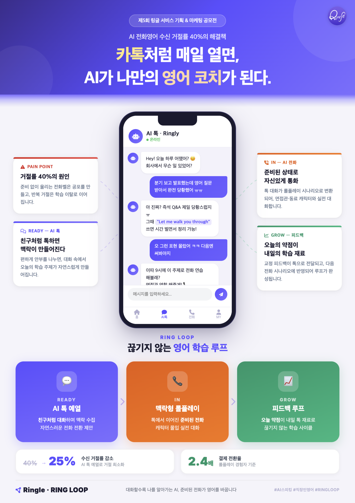

# RING LOOP — 내 이야기로 시작하는 AI 전화영어

> 제5회 링글 서비스 기획 & 마케팅 공모전 | 서비스 기획 부문

  

---

## 문제

링글 AI 전화영어는 AI가 먼저 전화를 걸어 영어 회화를 연습하게 해주는 서비스입니다.
그런데 사용자가 직접 예약해놓고도 전화를 안 받습니다. **수신 거절률 약 40%.**

전화벨이 울리는 순간 뭘 말해야 할지 모르니까요.
준비 안 된 영어 전화는 연습이 아니라 부담이 됩니다.

---

## 솔루션: RING LOOP

**전화 전에 먼저 대화를 시작하면 어떨까?**

AI가 톡으로 먼저 말을 겁니다. 가벼운 안부부터 시작해서, 대화 속에서 사용자의 관심사와 상황을 자연스럽게 파악합니다. 이렇게 모인 이야기가 그날의 전화 시나리오가 됩니다.

| 단계 | 내용 |
|---|---|
| **Ready** | AI 톡이 안부를 묻고, 대화하면서 오늘의 학습 소재를 만듭니다 |
| **In** | 톡에서 나눈 이야기가 전화 시나리오로 이어집니다. 뭘 말할지 아는 상태에서 받는 전화는 부담이 아니라 기대가 됩니다 |
| **Grow** | 통화 후 피드백이 톡으로 돌아오고, 오늘 막힌 표현이 내일 대화 소재가 됩니다 |

이 루프가 매일 돌면서, 갑자기 걸려오는 전화가 기다려지는 전화로 바뀝니다.

---

## 목표 KPI

| 지표 | 현재 | 목표 |
|---|---|---|
| AI 전화 수신 거절률 | 40% | 25% 이하 |
| 사용자 발신 비율 | 22.3% | 30% 이상 |
| 결제 전환율 (롤플레이 경험자) | 기준치 | 2.4배 |

---

## 프로토타입

**[프로토타입 체험하기](https://axseungpyo.github.io/Ringle/prototype/prototype.html)**

온보딩 → AI 톡 → 브리핑 → 전화 수신 → 통화 → 피드백 리포트 전체 플로우를 체험할 수 있습니다.

- **라이브 모드**: OpenAI API 키 입력 시 실제 GPT 대화 + 실시간 음성 인식
- **데모 모드**: API 키 없이 정적 시나리오로 체험

---

## 기술 스택

| 용도 | 기술 |
|---|---|
| 프로토타입 UI | HTML + Tailwind CSS + Vanilla JS |
| AI 채팅 | OpenAI GPT-4o-mini (스트리밍) |
| 실시간 음성 인식 | OpenAI Realtime API (WebSocket) |
| 음성 합성 | OpenAI GPT-4o-mini-TTS |

---

## 라이선스

본 프로젝트는 제5회 링글 서비스 기획 & 마케팅 공모전 출품 목적으로 제작되었습니다.
